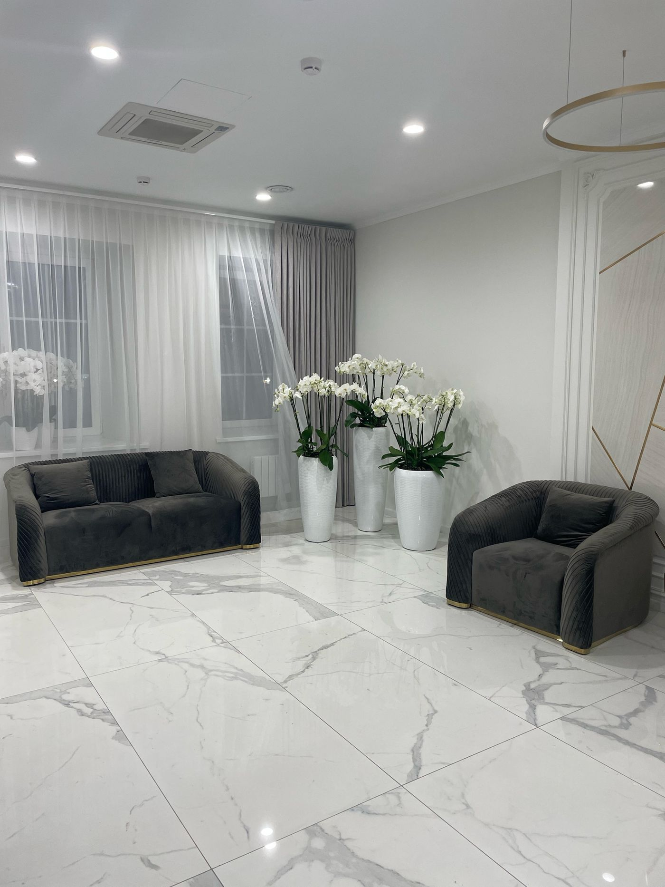

# АСЭНА ГРУПП — лендинг и презентация

Статичный сайт: главная страница про коммерческое строительство и отдельная
страница жилого направления. Без сборки и без зависимостей.

Вся типографика построена на одном шрифте Onest, разница задаётся только весом и размером.

## Структура

```
index.html            главная: коммерческое строительство
residential.html      жилые интерьеры, отдельное направление
assets/css/style.css  стили обеих страниц
assets/js/main.js     интерактив (меню, кадры первого экрана, лента проектов,
                      превью услуг, окна кейсов, форма заявки)
assets/img/           фотографии и логотипы
presentation.html     вёрстка PDF-презентации (15 слайдов, 16:9)
make-pdf.py           сборка презентации в PDF
robots.txt            закрывает превью от индексации, удалить на боевом домене
```

## Публикация

Загрузить содержимое папки (`index.html`, `residential.html` + `assets/`) в корень
хостинга — этого достаточно. Шрифты подключаются с Google Fonts, всё остальное лежит рядом.

Локальный просмотр:

```bash
python -m http.server 8777
```

Затем открыть `http://localhost:8777`. Просто дважды кликнуть по `index.html` тоже работает.

## Порядок блоков главной

Логика страницы: доверие → компетенции → доказательства → кейсы → заявка.

| Блок | Что делает |
|---|---|
| Первый экран | Оффер, две кнопки, цифры |
| Нам доверяют | Заказчики сразу под первым экраном |
| О компании | История, миссия, география |
| Как мы работаем | Пять шагов от задачи до сдачи объекта |
| Что мы берём на себя | Восемь услуг с нумерацией |
| Почему АСЭНА ГРУПП | Восемь причин, сюда же собраны все цифры |
| Портфолио | Девять объектов, карточка открывает кейс |
| Дубай | The Opus Tower отдельной широкой секцией |
| Специализация | Шесть типов объектов |
| Жилые интерьеры | Ссылка на `residential.html` |
| Партнёры | Три карточки в одну строку |
| Контакты | Форма заявки, телефон, почта |

## Что где править

| Что | Где |
|---|---|
| Телефон | `index.html` и `residential.html`, поиск по `423 82 55` |
| Почта | поиск по `stroy.element77` (там же в `assets/js/main.js`, `LEAD_EMAIL`) |
| Куда уходят заявки | `assets/js/main.js`, `LEAD_ENDPOINT` — см. раздел «Форма заявки» |
| Цифры (15 / 1 000 000 / 500 / 200) | `hero__meta` в первом экране и блок `<section class="why">` |
| Кадры первого экрана | блок `<div class="hero__stage">`, один `<div class="hero__slide">` это один кадр |
| Список услуг | блок `<ul class="srv">` |
| Шаги работы | блок `<ol class="flow__list">` |
| Карточки проектов | блок `<div class="railx__track">`, один `<article class="card">` это один объект |
| Содержимое кейсов | блоки `<template id="case-…">` в конце `index.html` |
| Список заказчиков | блок `<ul class="trust__list">` — см. раздел «Логотипы заказчиков» |
| Оговорка про оферту | `<p class="ftr__legal">` в подвале обеих страниц |
| Специализация | блок `<div class="spec__grid">` |
| Партнёры | блок `<div class="pt">` |
| Цвета | `assets/css/style.css`, переменные в `:root` (`--gold`, `--ink`, `--paper`) |
| Шрифт | `assets/css/style.css`, переменная `--f` и ссылка на Google Fonts в `<head>` |
| Фон | `assets/css/style.css`, переменные `--bg-glow`, `--bg-stone`, `--bg-grain`, `--bg-cursor` |

## Форма заявки

Формы стоят в двух местах: в блоке контактов и в окне, которое открывают кнопки
«Обсудить проект» по всей странице. Обязательны только имя и телефон.

Сейчас `LEAD_ENDPOINT` в `assets/js/main.js` пустой. В этом режиме форма собирает
письмо и открывает почтовую программу посетителя. Это работает на статичном
хостинге без сервера, но часть людей письмо не отправит.

Чтобы заявки приходили сами, нужен приёмник форм (Formspree, Getform или
собственный обработчик). Его адрес вписывается в одну строку:

```js
var LEAD_ENDPOINT = 'https://formspree.io/f/ваш-код';
```

Данные уйдут туда обычным POST в формате JSON, больше ничего менять не нужно.
В заявку попадает поле `source` — по нему видно, с какой кнопки пришёл человек
(шапка, первый экран, кейс объекта, блок Дубай).

Текст «Нажимая кнопку, вы соглашаетесь на обработку персональных данных» стоит
под каждой кнопкой отправки. Если у компании появится страница политики
обработки данных, на неё нужно поставить ссылку.

## Логотипы заказчиков

Блок «Нам доверяют» собран из плиток: логотип и название под ним.
Логотипы лежат в `assets/img/clients/`.

| Компания | Файл | Откуда |
|---|---|---|
| Сбербанк | `sber.svg` | Wikimedia Commons, `Sberbank Logo 2020.svg`, public domain |
| Банк ВТБ | `vtb.svg` | Wikimedia Commons, `VTB Logo 2018.svg`, public domain |
| МТС Банк | `mts.png` | Wikimedia Commons, `MTSBank Logo 800px.png`, public domain |
| Абсолют Банк | `absolut.png` | Wikimedia Commons, `Logo Absolut Bank.png`, public domain |
| ВкусВилл | `vkusvill.svg` | Wikimedia Commons, `Vkusvill textlogo 2021.svg`, public domain |
| Аэропорт Внуково | `vnukovo.png` | прислан заказчиком |
| Минюст РФ | `minjust.png` | прислан заказчиком |
| Город Столиц | `gorod.png` | прислан заказчиком |
| ФКР Москвы | `fkr.png` | прислан заказчиком |

Файлы с Commons помечены как public domain: словесные логотипы не дотягивают
до порога охраноспособности и авторским правом не защищены.

Что сделано с присланными файлами: у Внуково, Города Столиц и ФКР был залитый
фон (у ФКР вообще JPEG), его пришлось вырезать — иначе белый фильтр превращает
логотип в сплошной прямоугольник. У Внуково и Города Столиц оставлен только
графический знак без наборного текста: название всё равно подписано под плиткой,
а знак с текстом в строке высотой 46 px не читается. Все PNG обрезаны по краям
и уменьшены до высоты 96 px.

Логотипы приведены к белому монохрому фильтром `filter:brightness(0) invert(1)`
в правиле `.trust__i img`. Так зелёный Сбер, синий ВТБ и красный МТС не спорят
между собой на тёмном фоне и совпадают по цвету с названиями в соседних плитках.
Фильтр требует прозрачного фона: логотип на белой подложке станет белым
прямоугольником.

Размеры заданы через `max-height` и `max-width` одновременно: по высоте живут
квадратные знаки (пегас Внуково, герб), по ширине — широкие вордмарки
(«Абсолют Банк» это полоса с соотношением 10:1).

Герб Минюста детализованный, и на десктопе в белом силуэте он читается хуже
остальных: на 46 px прорисовка перьев сливается. На телефоне, где плитка шире,
он выглядит нормально. Если это будет мешать — проще вернуть Минюсту текстовую
плитку, убрав у неё ``.

Чтобы добавить или заменить логотип:

1. Положить файл в `assets/img/clients/` — SVG или PNG с прозрачным фоном.
2. Добавить `` первой строкой внутрь нужного `<li>`:

```html
<li class="trust__i">
  
  <span>Аэропорт Внуково</span>
</li>
```

Отсутствие авторских прав не отменяет права на товарный знак. Показывать знаки
Сбербанка, ВТБ и остальных как список заказчиков обычно допустимо, но у банков
в договорах часто есть запрет на публичное упоминание сотрудничества. Отдельная
история — эмблема Минюста: в ней государственный герб. Перед публикацией на
боевом домене стоит подтвердить у заказчика, что он вправе называть эти компании
и показывать их логотипы.

## Кейсы объектов

Карточка в портфолио открывает окно с описанием, фактами и галереей.
Содержимое каждого кейса лежит в `<template id="case-…">` в конце `index.html`,
`id` шаблона совпадает со значением `data-case` у карточки.

Фотографии внутри `<template>` браузер не загружает, пока кейс не открыли,
поэтому большие галереи не замедляют первую загрузку страницы.

Чтобы добавить объект: новая карточка `<article class="card" data-case="case-новый">`
в `<div class="railx__track">` и рядом новый `<template id="case-новый">`.

В галерее кейса класс `w` у `` растягивает фотографию на всю ширину окна,
без него фотография занимает половину.

## Первый экран

Первый экран это фотография объекта во весь экран. Кадры сменяют друг друга сами
каждые 3 секунды, картинка при этом медленно наезжает. Переключить кадр вручную
можно полосками-индикаторами, на телефоне ещё и свайпом.

Один кадр это один `<div class="hero__slide">` в блоке `<div class="hero__stage">`:

```html
<div class="hero__slide" style="--pos:62%" data-title="Офис в Москве" data-place="Статус и комфорт">
  
</div>
```

- `data-title` и `data-place` это подпись справа внизу, меняется вместе с кадром;
- `--pos` двигает кадр по вертикали при обрезке под экран: `0%` это верх фотографии,
  `100%` низ, по умолчанию центр. Пригодится, если после замены фотографии в кадр
  попало не то, что нужно;
- `fetchpriority="high"` стоит только у первого кадра, остальные грузятся после него.

Кадров может быть сколько угодно: добавить `<div class="hero__slide">` и рядом
ещё одну кнопку `<button class="hero__bar">` в блоке `.hero__bars` —
переключение подхватится само.

Длительность показа кадра записана в двух местах и менять надо оба:
`HOLD` в `assets/js/main.js` и `@keyframes heroBar` в `assets/css/style.css`.

При включённом «уменьшении движения» смена кадров и все выезды текста отключаются,
переключение полосками остаётся.

## Кэш браузера

Пути к стилям и скрипту в обеих страницах заканчиваются на `?v=7`. После правки
`style.css` или `main.js` номер нужно увеличить (`?v=8`) **в обоих файлах**,
иначе у тех, кто уже заходил на сайт, останется старая версия из кэша.

## Фон

Фон собран из четырёх слоёв в блоке `<div class="bg">`, каждый регулируется своей
переменной в `:root`. Значение `0` полностью гасит слой.

| Переменная | Слой | По умолчанию |
|---|---|---|
| `--bg-glow` | тёплые световые пятна в фирменных цветах, медленно дышат | `.34` |
| `--bg-stone` | текстура оникса `texture-onyx.jpg` из презентации компании | `.07` |
| `--bg-grain` | зерно, убирает плоскость и полосы на градиентах | `.05` |
| `--bg-cursor` | подсветка, которая идёт за курсором | `.5` |

Текстуру можно заменить любым другим файлом: положить в `assets/img/`
и поправить путь в правиле `.bg__stone`.

При включённом в системе «уменьшении движения» вся анимация фона отключается сама.

## Замена фотографии

Положить файл в `assets/img/` и заменить путь в `src` нужного ``.
Оптимальный размер до 1500 px по длинной стороне, JPEG качество ~80.

## Что на сайте написано не дословно по презентации

Всё фактическое (даты, площади, адреса, виды работ, цифры, заказчики) взято
из презентаций. Мои формулировки, которых в материалах нет:

- оффер первого экрана «Строим коммерческую недвижимость под ключ» и подзаголовок
  под ним. В презентации это «Строительство и управление проектами»;
- весь блок «Как мы работаем»: пять шагов от обсуждения задачи до передачи объекта;
- заголовки и подписи в блоке «Почему нам доверяют сложные объекты». Сами цифры
  (15 лет, 1 000 000+ м², 500+ проектов, 200+ клиентов) из презентации;
- подписи шести плиток в блоке «Специализация». Тексты про офисы, банки
  и премиальные интерьеры собраны из описаний направлений в презентации;
- подзаголовки у четырёх услуг: «Проектирование», «Генеральный подряд»,
  «Отделочные работы», «Управление проектами». У остальных четырёх описания из презентации;
- служебные заголовки разделов и подписи кнопок;
- описания в кейсах колледжа, Макеевки, административного здания, шлюзовых кабин
  и Абсолют Банка: развёрнуты из строки «Работы» в презентации. В кейсах Дубая,
  Костромы, Москвы и вип-отделений тексты взяты из презентации дословно;
- слово «Россия» в карточках трёх объектов, где город в презентации не указан:
  административное здание 350 м², шлюзовые кабины, Абсолют Банк;
- костромской объект назван «Управление Минюста по Костромской области». В первой
  презентации он подписан как «Административное здание, Кострома, ул. Лесная, 11»,
  во второй тот же объект по фотографиям это Управление Минюста. Если это разные
  объекты, название в карточке надо поменять;
- «The Opus Tower by Omniyat»: в презентации напечатано «Omnyat», на сайте
  исправлено на правильное написание застройщика;
- «В 2023 году мы завершили офис...» вместо «в прошлом году» из презентации,
  иначе на живом сайте фраза со временем станет неверной;
- периоды работ записаны словами («с апреля по декабрь 2023») вместо «апрель-декабрь 2023».

## Логотипы

Из макета заказчика (`IMG_5951.pdf`) вырезаны три версии с прозрачным фоном:

- `logo.png` — горизонтальный замок (знак + «АСЭНА ГРУПП»), используется в шапке и подвале
- `logo-full.png` — вертикальный замок, обложка презентации
- `logo-mark.png` и `favicon.png` — только знак

Слоган «Возводим вечность» набран текстом, а не картинкой: так он чётче и его можно
выделить. Акцентный цвет `--gold` взят пипеткой с логотипа.

## Партнёры

| Партнёр | Роль | Источник |
|---|---|---|
| Елена Крылова | дизайн интерьеров | helendesign.ru |
| СтройГеоПроект | BIM-проектирование | презентация «СтройГеоПроект BIM» |
| Битулаб | дорожные материалы | презентация «Битулаб дороги» |

Логотипы партнёров на сайте не используются: карточки набраны текстом, чтобы блок
выглядел единым. Логотипы Битулаба и СтройГеоПроекта есть в присланных PDF,
логотип Елены Крыловой лежит на её сайте.

## Заметки

- Компания переименована в «АСЭНА ГРУПП», но телефон и почта остались из старой
  презентации: `+7 910 423 82 55` и `stroy.element77@gmail.com`. Почта содержит
  старое название компании, её стоит проверить и, скорее всего, поменять.
- Email в исходной презентации был указан как `stroy.element77@gmal.com`
  (домен `gmal.com`, без `i`). На сайте стоит `gmail.com`.
- Жилое направление вынесено на отдельную страницу `residential.html`: на главной
  оно спорило с коммерческим позиционированием, когда шло сразу после банков,
  Минюста и Дубая. На главной от него осталась одна карточка со ссылкой.
- Цифры 15 лет, 1 000 000+ м², 500+ проектов и 200+ клиентов стоят на видном месте
  и работают как главный аргумент. Для сайта такого уровня они должны быть
  подтверждаемыми — стоит перепроверить их с заказчиком.
- Фотографии взяты из PDF-презентаций, их разрешение ограничено исходниками.
  Если у компании есть оригиналы — лучше заменить, качество вырастет заметно,
  особенно в галереях кейсов, где фотографии показываются крупно.
- Промсвязьбанк. На странице «ВИП отделения банков» во второй презентации есть
  фотографии отделения Промсвязьбанка, но в текстовом списке заказчиков его нет,
  поэтому в блок «Нам доверяют» он не попал. Если это их клиент, стоит добавить.
- Фоновая сетка `.blueprint` (вертикальные линии-подложка) отключена на экранах
  уже 860 px: на телефоне линии ложились прямо на текст и читались как случайная
  решётка. На десктопе она осталась. Если решётка не нужна совсем — убрать
  `.blueprint{ display:none; }` из медиазапроса и поставить это правило
  в основной блок `.blueprint` в `style.css`.
- Папка `dist/` — локальный дубликат корня для ручной загрузки на хостинг,
  она в `.gitignore` и после этих правок устарела. Если вы ей пользуетесь,
  соберите её заново.
